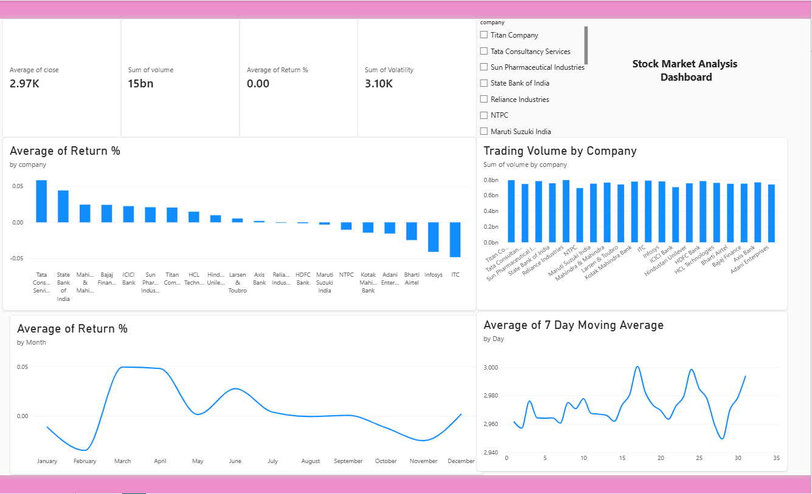

#  Stock Market Data Analysis

A complete Stock Market Data Analysis project using **SQL, Python, Pandas, and Power BI**.

# Project Objective

The objective of this project is to analyze stock market data and identify patterns in:

- Stock prices
- Daily returns
- Trading volume
- Volatility
- Company-wise performance
- Monthly performance
- 7-day moving average

# Tools & Technologies

- **SQL** – Data querying and analysis
- **Python** – Data analysis
- **Pandas** – Data cleaning and manipulation
- **Power BI** – Interactive dashboard
- **Jupyter Notebook** – Python analysis

#Project Files

| File | Description |
|---|---|
| `stock_market_analysis.sql` | SQL queries for stock market analysis |
| `stock_market_analysis.ipynb` | Python & Pandas analysis |
| `stock_market_dashboard.pbix` | Power BI dashboard |
| `stock_market_analyst_dataset` | Stock market dataset |

## 📈 Power BI Dashboard

The dashboard includes:

- Average Close Price
- Trading Volume
- Average Return %
- Volatility
- Company-wise Return Analysis
- Company-wise Trading Volume
- Monthly Return Analysis
- 7-Day Moving Average
- Company Filter/Slicer

# Key Analysis

# SQL
- Daily price change
- Price range
- Company-wise analysis
- Return analysis
- Volume analysis

#Python & Pandas
- Data loading
- Data cleaning
- Exploratory Data Analysis
- Return calculation
- Statistical analysis

# Power BI
- KPI cards
- Interactive charts
- Company slicer
- Monthly trend analysis
- Moving average analysis

## 📊 Dataset

The dataset contains stock market records including:

- Date
- Symbol
- Company
- Sector
- Open
- High
- Low
- Close
- Volume
- Return %
- Volatility
-  Power BI Dashboard

## 📈 Key Insights

- Analyzed 5,200 stock market records across 20 companies.
- Analyzed daily stock price changes and returns.
- Compared trading volume across companies.
- Calculated stock market volatility.
- Analyzed monthly return trends.
- Calculated and visualized a 7-day moving average.
- Built an interactive Power BI dashboard for data visualization.

## 🛠️ Project Workflow

1. Collected and prepared stock market data.
2. Used SQL for data analysis and querying.
3. Used Python and Pandas for data analysis.
4. Built visualizations and calculated key metrics.
5. Created an interactive Power BI dashboard.
6. Documented the complete project on GitHub.

## 👨‍💻 Skills Demonstrated

- SQL
- Python
- Pandas
- Power BI
- Data Analysis
- Data Visualization
- Dashboard Development

## 🚀 Project Workflow

 # Text
Raw Dataset
     ↓
Python + Pandas
     ↓
SQL Analysis
     ↓
Power BI Dashboard
     ↓
Insights & Visualization
